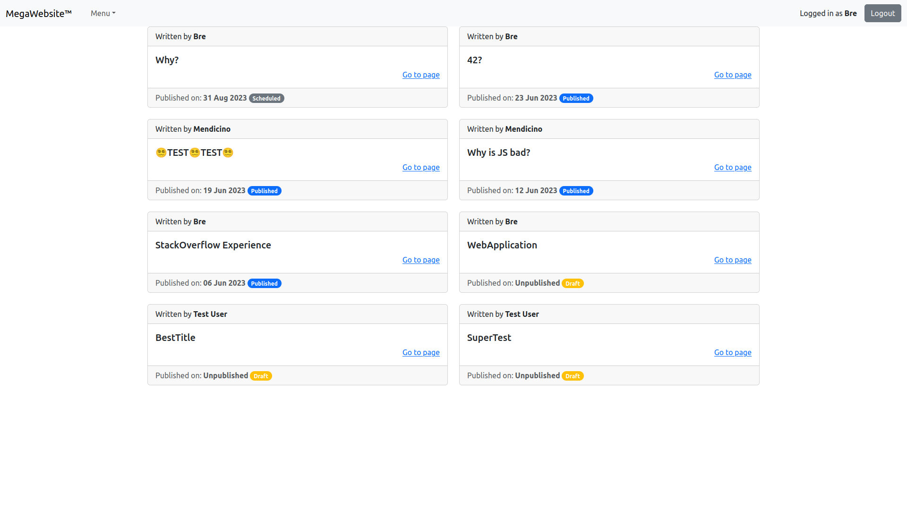
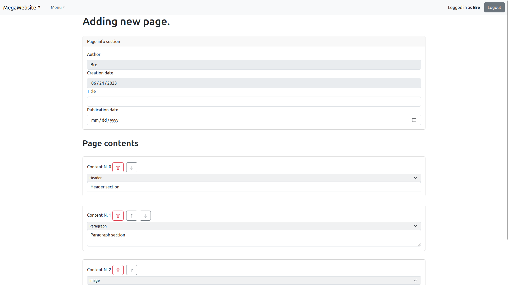

[](https://classroom.github.com/a/8AapHqUJ)

# Exam #N: "Exam Title"

## Student: s317639 MENDICINO BRENDON

## React Client Application Routes

- Route `/`: redirects to `/pages`
- Route `/login`: contains the login form, which allows authentication
- Route `/pages`: contains the list of pages ordered chronologically, it only shows published pages for non-logged users
- Route `/pages/add`: allows to compile a form to insert a new page with his contents
- Route `/pages/:pageId/contents`: brings to a specific page identifed by `:pageId`, with the relative info and the list of contentents (relative to that `:pageId`)
- Route `/pages/:pageId/edit`: allows to modify a page via a form (can be done only by the authro of the page or by an admin)
- Route `/*`: any other non-intended route, contains the *404Page*

## API Server

- GET `/api/pages`
  - description: get the list of pages, they are returned ordered by `publicationDate`, non-authenticated user will only receive "published" pages
  - response body content
  ```json
  [
    {
      "id": 1,
      "userId": 1,
      "title": "Why JS is bad.",
      "author": "Brendon",
      "creationDate": "2020-10-01",
      "publicationDate": "2020-10-02"
    },
    ...
  ]
  ```
  - repsonse status
    - `200 OK`
- PUT `/api/pages`
  - description: add a new page
  - request body
  ```json
  {
    "id": 1,
    "userId": 1,
    "title": "Why JS is bad.",
    "author": "Brendon",
    "creationDate": "2020-10-01",
    "publicationDate": "2020-10-02",
    "contents": [
      {
        "id": 1,
        "contentType": "header",
        "content": "Content text"
      },
      ...
    ]
  }
  ```
  - repsonse body: empty
  - response status:
    - `201 Created`
    - `400 Bad Request` a page must alway contain at least one header and at least another content
    - `401 Unauthorized` unauthenticated user
    - `500 Internal Server Error`
- DELETE `/api/pages/:pageId`
  - description: delete a page and all his contents, only the owner of the page or an admin can perform this action
  - request body: empty
  - response body: empty
  - response status:
    - `204 No Content`
    - `401 Unauthorized` wasn't owner of the page nor an admin
    - `404 Not Found` page not found
    - `500 Internal Server Error`
- GET `/api/pages/:pageId`
  - description: get a single page, non-authenticated users will only receive "published" pages
  - request body: empty
  - response body content
  ```json
  {
    "id": 1,
    "userId": 1,
    "title": "Why JS is bad.",
    "author": "Brendon",
    "creationDate": "2020-10-01",
    "publicationDate": "2020-10-02"
  }
  ```
  - repsonse status
    - `200 OK`
    - `401 Unauthorized` If non-authenticated user tried to access non-"published" page
    - `404 Not Found` Page not found
    - `500 Internal Server Error`
- POST `/api/pages/:pageId`
  - description: update a page and his contents, only the owner of the page or an admin can perform this action
  - request body
  ```json
  {
    "id": 1,
    "userId": 1,
    "title": "Why JS is bad.",
    "author": "Brendon",
    "creationDate": "2020-10-01",
    "publicationDate": "2020-10-02",
    "contents": [
      {
        "id": 1,
        "contentType": "header",
        "content": "Content text"
      },
      ...
    ]
  }
  ```
  - response body: empty
  - response status:
    - `204 No Content`
    - `401 Unauthorized` wasn't owner of the page nor an admin
    - `404 Not Found` page not found
    - `500 Internal Server Error`
- GET `/api/pages/:pageId/contents`
  - description: get the ordered list of contents of a page
  - request body: empty
  - response body:
  ```json
  [
    {
      "id": 1,
      "contentType": "header",
      "content": "Contains the header text"
    },
    ...
  ]
  ```
  - response status:
    - `200 OK`
    - `404 Not Found` page not found
    - `500 Internal Server Error`

<!-- - PUT `/api/pages/:pageId/contents`
  - description: add a new content to a page
  - request body:
  ```json
  {
    "id": 1,
    "contentType": "header",
    "content": "Contains the header text"
  }
  ```
  - response body: empty
  - response status:
    - `200 OK`
    - `401 Unauthorized` wasn't owner of the page nor an admin
    - `404 Not Found` page not found
    - `500 Internal Server Error`
- POST `/api/pages/:pageId/contents/order`
  - description: update the order of a page contets
  - request body: contains on ordered list of `contentId`
  ```json
  [3, 1, 2, 5, 4]
  ```
  - response status:
    - `200 OK`
    - `401 Unauthorized` wasn't owner of the page nor an admin
    - `404 Not Found` page or content not found
    - `500 Internal Server Error`
- POST `/api/pages/:pageId/contents/:contentId`
  - description: update a content of a page
  - request body:
  ```json
  {
    "id": 1,
    "contentType": "header",
    "content": "Contains the header text"
  }
  ```
  - response body: empty
  - response status:
    - `200 OK`
    - `401 Unauthorized` wasn't owner of the page nor an admin
    - `404 Not Found` page not found
    - `500 Internal Server Error`
- DELETE `/api/pages/:pageId/contents/:contentId`
  - descritpion: delete a content from a page
  - request body: empty
  - response body: empty
  - response status:
    - `200 OK`
    - `400 Bad Request` a page must alway contain at least one header and at least another content -->

- POST `/api/login`
  - description: login to receive `sessionId`
  - request body:
  ```json
  { "username": "bre@bre.it", "password": "password" }
  ```
  - response body:
  ```json
  {
    "id": 1,
    "email": "bre@bre.it",
    "name": "Brendon",
    "role": "admin"
  }
  ```
  - response status:
    - `201 Created`
    - `400 Bad Request` wrong username or password
- GET `/api/login`
  - description: check if the current user is logged in
  - request body: empty
  - response body:
  ```json
  {
    "id": 1,
    "email": "bre@bre.it",
    "name": "Brendon",
    "role": "admin"
  }
  ```
  - response status:
    - `200 OK`: **if authenticated**
    - `404 Not Found`: **if not authenticated**
    - `500 Interal Server Error`
- DELETE `/api/logout`
  - description: logout the current user from the server
  - request body: empty
  - response body: empy
  - response status:
    - `204 No Content`
    - `400 Bad Request`
- GET `/api/webpage/name`
  - description: get the name of the webpage
  - request body: empty
  - response body:
  ```json
  { "name": "Sito WebApp" }
  ```
  - response status:
    - `200 OK`
    - `500 Interal Server Error`
- POST `/api/webpage/name`
  - desription: update the name of the webpage, only Admins can access this route
  - request body:
  ```json
  { "name": "Sito WebApp" }
  ```
  - response body: empty
  - response status:
    - `204 No Content`
    - `400 Bad Request` wrong format
    - `401 Unauthorized`
    - `500 Internal Server Error`
- PUT `/api/register`
  - description: register new user (just for testing)
  - request body:
  ```json
  {
    "name": "Brendon",
    "role": "admin",
    "email": "s123456@studenti.polito.it",
    "password": "123456789"
  }
  ```
  - response body: empty
  - response status:
    - `204 No Content`
    - `500 Internal Server Error`
- GET `/api/users`
  - description: get registered usres, only admin can access this route
  - request body: empty
  - response body:
  ```json
  [
    {
      "id": 1,
      "email": "bre@bre.it",
      "name": "Brendon",
      "role": "admin"
    },
    ...
  ]
  ```
  - response status:
    - `200 OK`: _if admin_
    - `401 Unauthorized`: _if not admin_
    - `500 Server Interal Error`

## Database Tables

- Table `users` - represent the registred users
  | `id` | `email` | `name` | `role` | `hash` | `salt` |
  |-|-|-|-|-|-|

  - `hash`: `password + salt` through cryptographic hash function, 32 bytes
  - `salt`: random 8 bytes

- Table `pages` - represent the pages created by the users
  | `id` | `userId` | `title` | `creationDate` | `publicationDate` |
  |-|-|-|-|-|

  - `userId FOREIGN KEY users(id)` with `ON DELETE CASCADE`

- Table `contents` - represent a single content inside a page
  | `id` | `pageId` | `contentType` | `content` | `order` |
  |-|-|-|-|-|

  - `pageId FOREIGN KEY pages(id)` with `ON DELETE CASCADE`

- Table `webpage` - contains some informations about the webpage
  | `name` |
  |-|

## Main React Components

- `App` (in `App.jsx`): only contains the routes and the `AuthContext.Provider`
- `AuthProvider` in (in `AuthContext.jsx`): contains the logged `User` state and a setter function for him, when invoked it contains a `useEffect` that fetches the logged user (if any) from the server
- `LoginComponent` (in `LoginComponent.jsx`): contains a form with *username* and *password* to fill for the authentication
- `PageComponent` (in `PageComponent.jsx`): fetched the pages from the server and displays them as a list, every item (`PageItem`) contains a `Link` to the the respective contents of the page, navigating to `/pages/:pageId/contents`
- `NavbarComponent` (in `NavbarComponent.jsx`): contains the name of the page (fetched from the server), a button for login/logout, a dropdown menu with:
  - a button to insert a new page
  - a button to change the name of the website
- `PageContentsComponent` (in `PageContentsComponent.jsx`): fetches the page (with `pageId` from params) and his relative contents from the server, then it displays them in a list of `Card`s. If the current `user` is the author of the page or is an admin, he can edit or delete the current page
- `ContentListComponent` (in `ContentListComponent.jsx`): represent the actual list of contentes of a page, displaying conditionally different types of blocks
- `PageFormComponent` (in `PageComponent.jsx`): represent the structure of a `Page` and his `Content`s, it allows the modification of both of them. This is done by passing the state to his props, and when the submit button is clicked and the validation is correct the `handleSubmit` callaback is invoked
- `AddPageComponent` (in `AddPageComponent.jsx`): wraps around `PageFormComponent`, sets a new page state with basic attributes: 
  - current date
  - author (current user)
  - default contents
  - a list of all users if current user is admin
- `UpdatePageComponent` (in `UpdatePageComponent.jsx`): wraps around `PageFormComponent`, behaves like `AddPageComponent`, but instead of passing defaults page and components they are in a first moment taken from the `location` and then fetched from the server

## Screenshot




## Users Credentials

- `bre@bre.it`, `test` (Normal user)
- `test@test.it`, `test` (Normal user)
- `s@polito.it`, `poli` (Admin user)
- `boh@boh.xyz`, `supersecret` (Admin user)
